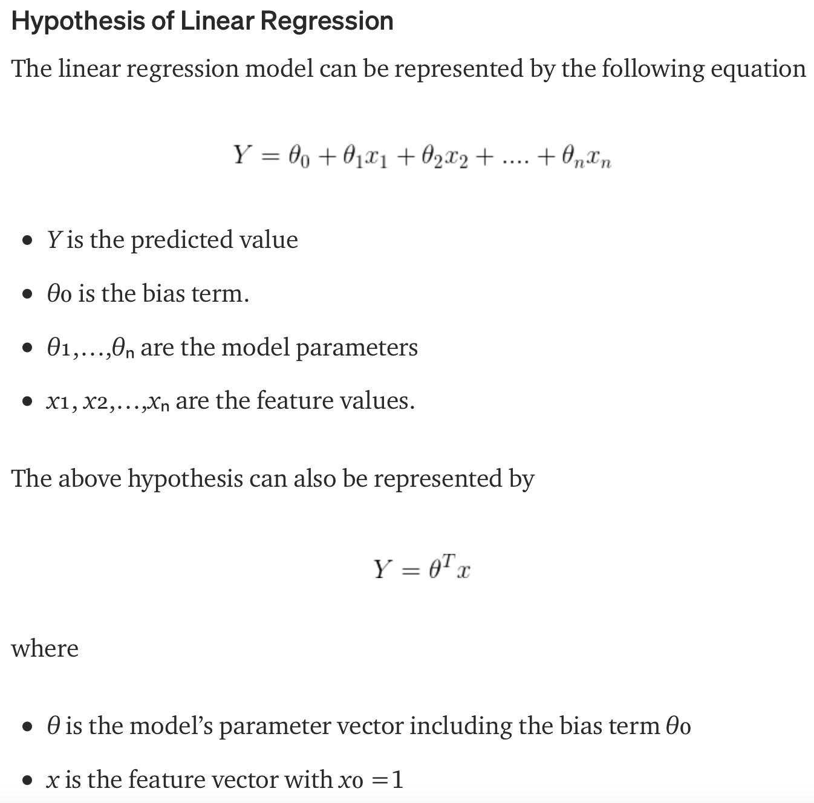

# Regression Machine Learning for data prediction 
Predict data using Regression Techniques in python

2 experiments: 
- using linear regression to predict random numeric data distribution;
- using multiple regression to predict, given a csv dataset, the CO2 distrubution of a car given its weight and volume.

The objective of a linear regression model is to find a relationship between one or more features(independent variables) and a continuous target variable(dependent variable). When there is only feature it is called Uni-variate Linear Regression and if there are multiple features, it is called Multiple Linear Regression.

# First approach

# Second approach

## References
https://towardsdatascience.com/linear-regression-using-python-b136c91bf0a2
https://www.w3schools.com/python/python_ml_multiple_regression.asp
