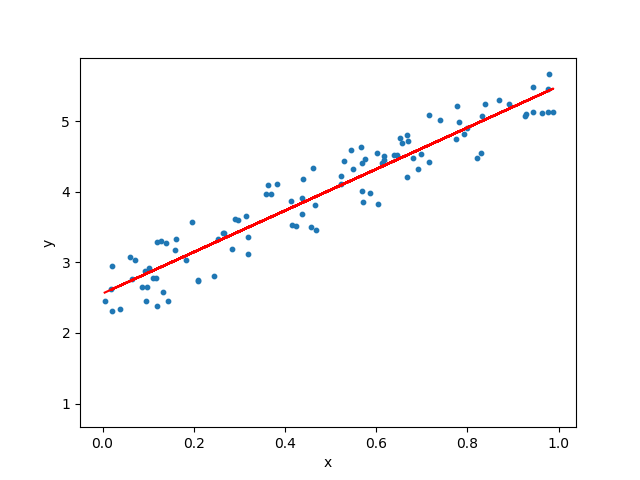

# Regression Machine Learning for data prediction 
Predict data using Regression Techniques in python

2 experiments: 
- using linear regression to predict random numeric data distribution;
- using multiple regression to predict, given a csv dataset, the CO2 distrubution of a car given its weight and volume.

The objective of a linear regression model is to find a relationship between one or more features(independent variables) and a continuous target variable(dependent variable). When there is only feature it is called Uni-variate Linear Regression and if there are multiple features, it is called Multiple Linear Regression.

The line for which the the error between the predicted values and the observed values is minimum is called the best fit line or the regression line. These errors are also called as residuals. The residuals can be visualized by the vertical lines from the observed data value to the regression line.
To define and measure the error of our model we define the cost function as the sum of the squares of the residuals. So the objective is to find the model parameters so that the cost function is minimum. We can use Gradient Descent to find this.

# First approach
We want to predict random data distribution between 0 and 100.
In particolar for the Y function we will have in the code: y = 2 + 3 * x + np.random.rand(100, 1)

The final reached output is the following

with a very good accuracy: R2 score = 0.9

NB: numpy + matplotlib + sklearn modules used

# Second approach
In this experiment we want to predict cars CO2 emission given the pandas dataset.csv
In the proposed work I predict the CO2 emission of a car where the weight is 2300kg, and the volume is 1300cm3; the output was good: 107.2

NB: I used pandas module

## References
https://towardsdatascience.com/linear-regression-using-python-b136c91bf0a2
https://www.w3schools.com/python/python_ml_multiple_regression.asp
